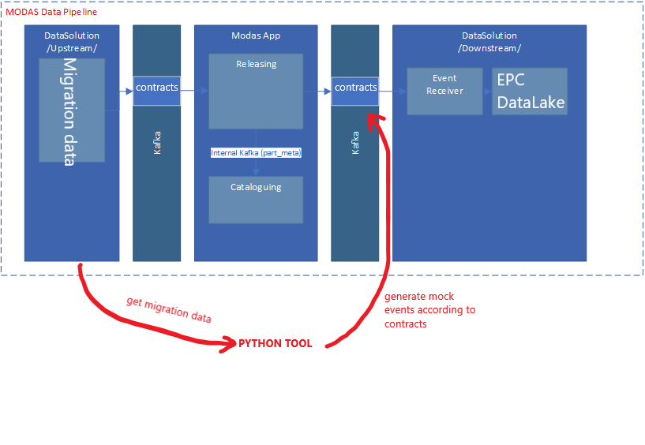

# The origin and the purpose of this tool
The whole MoDAS project is a cooperation between DS team and App team (Modas).
Modas will replace the current working systems such as OPTICS, PCII, GCAT, thus it will soon be a source for such systems as EPC, Datalake.

DS team is responsbile for reading events sent by Modas and shape it into a proper format for downstream system requirements.

The platform used to communicate between Modas and DS is Kafka and events are jsons which definition is specified in agreed [contracts](http://docs.ctglobal.cliffordthames.com/display/JLRMODAS/Contracts+Modas+Downstream) between both parties

The flow looks like that:

What was the problem? Well, DS team could start working on reading downstream, but Modas was not ready at all at this time to send some sample events.

So we used python to do so and we prepared those events on our own to proceed :)

The result was a tool which prepares full or 10k (for faster processing) consistent migration data in a form of jsons according to the agreed contracts.

The logic is simple:
- send a query to db and retrieve the data (pyodbc)
- shape a tabluar data into a json/dictionary format
- send created jsons to kafka (confluent_kafka)
- BONUS - send multiple contracts simultaneously (multiprocessing)

# Getting Started
1.	Installation process
    * download and install python
    * * install virtualenv by running `pip install virtualenv`
    * pull this repository to your local machine
    * when in the main folder, open cmd and run:
    ~~~~
    virtualenv venv
    ~~~~

    This will create a local python env in venv folder
    Then activate this python env by:
    ~~~~
    venv\Scripts\activate
    ~~~~

    When activated install required packages by:
    ~~~~
    pip install -r requirements.txt
    ~~~~

2. Where do you get the data?

    The source data for events is ModasTransform db (or a 10k, 200k version...)

    Backups are located here: \\\S245\gcs-jlrepc\Stage2\PP\ModasTransform

    To create such a db use [this](https://dev.azure.com/OEC-EUR/JLRModasIntegration/_git/Oec.Migration.Jag?path=%2FModasMigration%2FModasTransformToKafka%2FScripts%2FPrepareSamplesForAllContracts10k.sql&version=GBmaster)

3.	Usage

    Run `python run.py` to get more help :)

